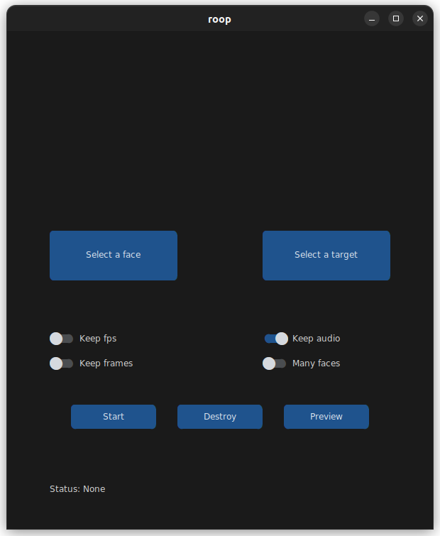

Take a video and replace the face in it with a face of your choice. You only need one image of the desired face. No dataset, no training.

You can watch some demos [here](https://drive.google.com/drive/folders/1KHv8n_rd3Lcr2v7jBq1yPSTWM554Gq8e?usp=sharing). A StableDiffusion extension is also available, [here](https://github.com/s0md3v/sd-webui-roop).


## Disclaimer
This software is meant to be a productive contribution to the rapidly growing AI-generated media industry. It will help artists with tasks such as animating a custom character or using the character as a model for clothing etc.

The developers of this software are aware of its possible unethical applications and are committed to take preventative measures against them. It has a built-in check which prevents the program from working on inappropriate media including but not limited to nudity, graphic content, sensitive material such as war footage etc. We will continue to develop this project in the positive direction while adhering to law and ethics. This project may be shut down or include watermarks on the output if requested by law.

Users of this software are expected to use this software responsibly while abiding the local law. If face of a real person is being used, users are suggested to get consent from the concerned person and clearly mention that it is a deepfake when posting content online. Developers of this software will not be responsible for actions of end-users.

## How do I install it?

### Basic

It is more likely to work on your computer but it will also be very slow. You can follow instructions for the basic install [here](https://github.com/s0md3v/roop/wiki/1.-Installation).

### Acceleration

If you have a good GPU and are ready for solving any software issues you may face, you can enable GPU which is wayyy faster. To do this, first follow the basic install instructions given above and then follow GPU-specific instructions [here](https://github.com/s0md3v/roop/wiki/2.-Acceleration).

## How do I use it?

Executing `python run.py` command will launch this window:



Choose a face (image with desired face) and the target image/video (image/video in which you want to replace the face) and click on `Start`. Open file explorer and navigate to the directory you select your output to be in. You will find a directory named `<video_title>` where you can see the frames being swapped in realtime. Once the processing is done, it will create the output file. That's it.

Additional command line arguments are given below. To learn out what they do, check [this guide](https://github.com/s0md3v/roop/wiki/Advanced-Options).

```
options:
  -h, --help                                               show this help message and exit
  -s SOURCE_PATH, --source SOURCE_PATH                     select an source image
  -t TARGET_PATH, --target TARGET_PATH                     select an target image or video
  -o OUTPUT_PATH, --output OUTPUT_PATH                     select output file or directory
  --frame-processor FRAME_PROCESSOR [FRAME_PROCESSOR ...]  frame processors (choices: face_swapper, face_enhancer, ...)
  --keep-fps                                               keep target fps
  --keep-frames                                            keep temporary frames
  --skip-audio                                             skip target audio
  --many-faces                                             process every face
  --reference-face-position REFERENCE_FACE_POSITION        position of the reference face
  --reference-frame-number REFERENCE_FRAME_NUMBER          number of the reference frame
  --similar-face-distance SIMILAR_FACE_DISTANCE            face distance used for recognition
  --video-encoder {libx264,libx265,libvpx-vp9}             adjust output video encoder
  --video-quality [0-51]                                   adjust output video quality
  --max-memory MAX_MEMORY                                  maximum amount of RAM in GB
  --execution-provider {cpu} [{cpu} ...]                   available execution provider (choices: cpu, ...)
  --execution-threads EXECUTION_THREADS                    number of execution threads
  -v, --version                                            show program's version number and exit
```

Looking for a CLI mode? Using the -s/--source argument will make the run program in cli mode.

## Credits
- [henryruhs](https://github.com/henryruhs): for being an irreplaceable contributor to the project
- [ffmpeg](https://ffmpeg.org/): for making video related operations easy
- [deepinsight](https://github.com/deepinsight): for their [insightface](https://github.com/deepinsight/insightface) project which provided a well-made library and models.
- and all developers behind libraries used in this project.
